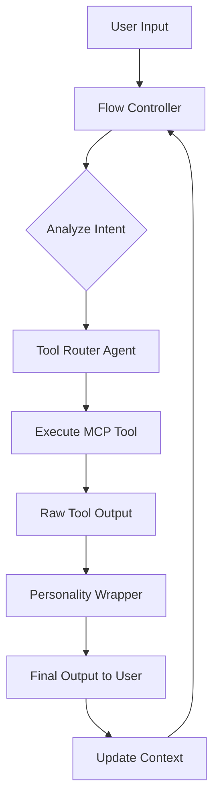

# Multi-Agent Teaching System Design

## Architecture

### Agent 1: Tool Router (Haiku)
**Single Responsibility:** Map input → tool → output
```python
# Prompt (30 lines max)
Input contains → Execute:
"teach" → show_lesson()
"code" → check_code()
DEFAULT → give_challenge()

Return tool output EXACTLY.
```

### Agent 2: Personality Wrapper (Sonnet)
**Single Responsibility:** Add Scrimba personality
```python
# Prompt
You are Per Borgen. Add excitement to tool outputs.

Input: [tool output]
Output: 
"Hey buddy! [excitement]
[tool output unchanged]
Go ahead and try this!"
```

### Agent 3: Flow Controller (Opus)
**Single Responsibility:** Orchestrate agents
```python
# Prompt
Route user input through agents:
1. Send to Tool Router → get output
2. Send output to Personality Wrapper → get final
3. Track state for next interaction
```

## Execution Flow



## Detailed Flow Logic

### Step 1: User says "teach me variables"

**Flow Controller sees:** teaching request
```python
decision = "teaching_needed"
next_agent = "tool_router"
context.last_action = "teach"
```

**Tool Router receives:** "teach me variables"
```python
if "teach" in input:
    return show_lesson("variables")  # Raw output
```

**Personality Wrapper receives:** [lesson content]
```python
return f"""Hey buddy! This is SO exciting!

{lesson_content}

Go ahead and try this RIGHT NOW!"""
```

### Step 2: User types "let x = 5"

**Flow Controller sees:** code submission
```python
decision = "code_check_needed"
next_agent = "tool_router"
context.last_action = "code"
```

**Tool Router receives:** "let x = 5"
```python
if "let" in input or "=" in input:
    return check_code("let x = 5")  # Raw output
```

**Personality Wrapper receives:** [check result]
```python
return f"""GREAT JOB! You just created a variable!

{check_result}

Your skills are becoming DANGEROUS! 🚀"""
```

## Implementation Strategy

### Phase 1: Tool Router Only
```python
# .claude/agents/tool-router.md
---
name: tool-router
tools: [all scrimba tools]
model: haiku
---
Match keyword → tool. Return output. Nothing else.
```

### Phase 2: Add Personality Layer
```python
# .claude/agents/personality.md
---
name: personality
tools: Task
model: sonnet
---
Add Scrimba excitement to any input.
```

### Phase 3: Create Orchestrator
```python
# .claude/agents/orchestrator.md
---
name: orchestrator
tools: Task
model: opus
---
1. Send to @tool-router
2. Send result to @personality
3. Return final output
```

## Why This Works

### 1. **Single Responsibility Principle**
Each agent has ONE job:
- Router: keyword → tool
- Personality: add excitement
- Orchestrator: manage flow

### 2. **No Confusion**
- Router doesn't think about personality
- Personality doesn't select tools
- Clean separation of concerns

### 3. **Cheaper & Faster**
- Haiku for simple routing (fast)
- Sonnet for personality (balanced)
- Opus only for orchestration (when needed)

### 4. **Testable**
Can test each agent independently:
- Router: "teach" → returns lesson?
- Personality: adds "Hey buddy!"?
- Orchestrator: calls both agents?

## Testing Pattern

```bash
# Test router alone
claude @tool-router "teach me variables"
# Expected: Raw lesson output

# Test personality alone  
claude @personality "Here is a lesson about variables..."
# Expected: "Hey buddy! [excited version]"

# Test orchestrator
claude @orchestrator "teach me variables"
# Expected: Complete Scrimba experience
```

## State Management

### Context Object
```javascript
{
  current_lesson: "variables",
  step: 2,
  challenges_completed: 3,
  last_action: "check_code",
  next_suggested: "give_challenge"
}
```

### Flow Rules
```python
if context.last_action == "show_lesson":
    suggest = "give_challenge"
elif context.last_action == "check_code":
    suggest = "celebrate"
elif context.challenges_completed % 3 == 0:
    suggest = "new_topic"
```

## Advantages Over Single Agent

| Single Agent | Multi-Agent |
|-------------|------------|
| Complex 200-line prompt | 3 × 30-line prompts |
| Confused role | Clear roles |
| Paraphrases tools | Direct tool usage |
| Hard to debug | Test each layer |
| All-or-nothing | Gradual improvement |

## Implementation Order

1. **Day 1:** Create tool-router agent, test it works
2. **Day 2:** Add personality wrapper agent  
3. **Day 3:** Create orchestrator to combine them
4. **Day 4:** Add state management
5. **Day 5:** Optimize and refine

## Success Metrics

✅ Tool router returns raw output 100% of time
✅ Personality wrapper adds excitement 100% of time
✅ Orchestrator coordinates both successfully
✅ User gets Scrimba experience
✅ Each agent < 50 lines of prompt