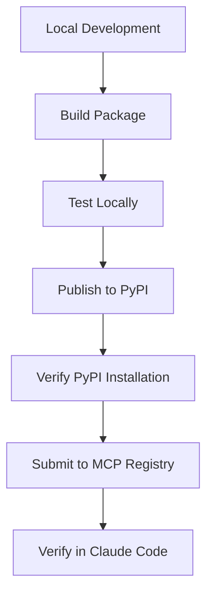

# Scrimba MCP Unified - Deployment Guide

## Package Information
- **Name**: scrimba-mcp-unified
- **Version**: 3.0.0
- **Registry Name**: io.github.Skills03/scrimba-mcp-unified
- **PyPI Package**: https://pypi.org/project/scrimba-mcp-unified/

## Flow of Deployment



## Prerequisites

1. **Python Package Tools**:
   ```bash
   pip install --upgrade build twine
   ```

2. **PyPI Account**:
   - Create account at https://pypi.org
   - Generate API token from Account Settings
   - Save as `~/.pypirc`:
   ```ini
   [pypi]
   username = __token__
   password = pypi-YOUR_TOKEN_HERE
   ```

3. **MCP Publisher** (Optional):
   ```bash
   # macOS
   brew install mcp-publisher
   
   # Or download from GitHub
   # https://github.com/modelcontextprotocol/publisher
   ```

## Step-by-Step Deployment

### 1. Build the Package

```bash
cd /home/rishabh/Desktop/dev/claude-code-mcp/scrimba-mcp-unified

# Clean previous builds
rm -rf dist/ build/ *.egg-info

# Build distribution packages
python -m build
```

This creates:
- `dist/scrimba_mcp_unified-3.0.0.tar.gz` (source distribution)
- `dist/scrimba_mcp_unified-3.0.0-py3-none-any.whl` (wheel)

### 2. Test Locally

```bash
# Install locally
pip install dist/scrimba_mcp_unified-3.0.0-py3-none-any.whl

# Test CLI command
scrimba-mcp-unified --test

# Test with Claude Code
claude -p "Use scrimba-mcp-unified teach tool to explain variables"
```

### 3. Publish to PyPI

```bash
# Check package integrity
twine check dist/*

# Upload to PyPI
twine upload dist/*
```

Or use the automated script:
```bash
./deploy_to_registry.sh
```

### 4. Verify PyPI Installation

```bash
# Uninstall local version
pip uninstall scrimba-mcp-unified

# Install from PyPI
pip install scrimba-mcp-unified

# Verify it works
scrimba-mcp-unified --test
```

### 5. Submit to MCP Registry

#### Option A: Using MCP Publisher CLI

```bash
# Authenticate with GitHub
mcp-publisher auth github

# Validate server.json
mcp-publisher validate

# Publish to registry
mcp-publisher publish
```

#### Option B: Using REST API

```bash
# Submit server.json to registry
curl -X POST https://registry.modelcontextprotocol.io/v0/servers \
  -H "Content-Type: application/json" \
  -d @server.json
```

### 6. Configure Claude Desktop

Update `~/Library/Application Support/Claude/claude_desktop_config.json`:

```json
{
  "mcpServers": {
    "scrimba-mcp-unified": {
      "command": "scrimba-mcp-unified"
    }
  }
}
```

Or install from PyPI:
```json
{
  "mcpServers": {
    "scrimba-mcp-unified": {
      "command": "uvx",
      "args": ["scrimba-mcp-unified"]
    }
  }
}
```

### 7. Verify in Claude Code

```bash
# List MCP servers
claude mcp list

# Should show:
# scrimba-mcp-unified: ✓ Connected

# Test tools
claude -p "Use the teach tool to explain loops"
claude -p "Give me a coding challenge"
claude -p "Visualize how arrays work"
```

## Package Structure

```
scrimba-mcp-unified/
├── scrimba_mcp_unified/
│   ├── __init__.py          # Package initialization
│   ├── __main__.py          # CLI entry point
│   └── server.py            # Main MCP server implementation
├── pyproject.toml           # Python package configuration
├── server.json              # MCP registry configuration
├── README.md                # Documentation
└── LICENSE                  # MIT license
```

## server.json Configuration

```json
{
  "$schema": "https://static.modelcontextprotocol.io/schemas/2025-07-09/server.schema.json",
  "name": "io.github.Skills03/scrimba-mcp-unified",
  "description": "Unified MCP for Scrimba's interactive programming education",
  "version": "3.0.0",
  "packages": [{
    "registry_type": "pypi",
    "identifier": "scrimba-mcp-unified",
    "version": "3.0.0",
    "transport": {
      "type": "stdio"
    }
  }]
}
```

## Available Tools

The unified server provides these tools:

1. **scrimba_agent** - Intelligent router for all requests
2. **teach** - Interactive programming lessons (5 complexity levels)
3. **give_challenge** - Timed coding challenges
4. **check_code** - Encouraging code review
5. **celebrate** - Achievement celebrations
6. **show_hint** - Progressive hints
7. **next_lesson** - Progress to next step
8. **start_project** - Real-world projects
9. **show_progress** - Learning journey tracker
10. **visualize_concept** - Visual learning prompts
11. **animate_concept** - Step-by-step animations
12. **visual_challenge** - Visual programming challenges
13. **explain_with_diagram** - Code visualization
14. **create_meme** - Programming humor
15. **variable_visualizer** - Variable operations
16. **comparison_visualizer** - Comparison operations
17. **array_visualizer** - Array operations
18. **function_sequencer** - Function execution
19. **object_visualizer** - Object properties
20. **loop_animator** - Loop visualization

## Troubleshooting

### Package Not Found on PyPI
- Wait 1-2 minutes for propagation
- Check: `pip search scrimba-mcp-unified`

### MCP Server Not Connecting
- Restart Claude Desktop
- Check logs: `~/Library/Logs/Claude/`
- Verify: `claude mcp list`

### Tools Not Working
- Ensure fastmcp is installed: `pip install fastmcp`
- Test directly: `python -m scrimba_mcp_unified`

## Verification Script

Run the included verification script:
```bash
./verify_deployment.py
```

This checks:
- PyPI package availability
- MCP registry listing
- Local installation
- Claude Code integration

## Next Steps

1. **Monitor Usage**:
   - Check PyPI download stats
   - Monitor MCP registry metrics

2. **Updates**:
   - Increment version in pyproject.toml
   - Update server.json version
   - Rebuild and republish

3. **Community**:
   - Create GitHub issues for feedback
   - Update documentation
   - Add examples and tutorials

## Support

- **GitHub Issues**: https://github.com/Skills03/claude-code-mcp/issues
- **Documentation**: https://github.com/Skills03/claude-code-mcp/blob/main/scrimba-mcp-unified/README.md
- **MCP Registry**: https://registry.modelcontextprotocol.io

---

**Last Updated**: 2025-09-24
**Status**: Ready for deployment to PyPI and MCP Registry